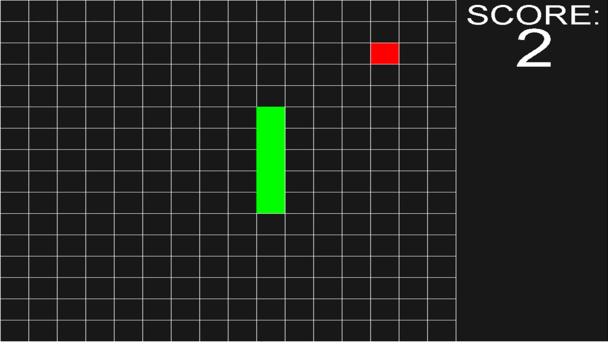

For my final ICS 111 Project, I developed a version of the game snake alongside my partner Fara. The purpose of this project was to test our understanding of 2D arrays and finite state machines. 

Our approach to creating the game snake was to have each pixel represent a element in a 2D array. Each pixel could then have different colors or states. Black represented empty space. Green represented the snakes body. Red represented an apple. From there we used loops and conditional statements to refresh the screen and trigger actions. My role in the group was primarily gameplay. I was in charge of gameplay aspects such as movement and collision detection. 

I enjoyed working on this project because Snake is such a classic and iconic game. Using all of the knowledge I learned in ICS 111 I was able to recreate a game I was familiar playing.
 
Gameplay: <https://www.youtube.com/watch?v=T9N8dJpyW7g> 

