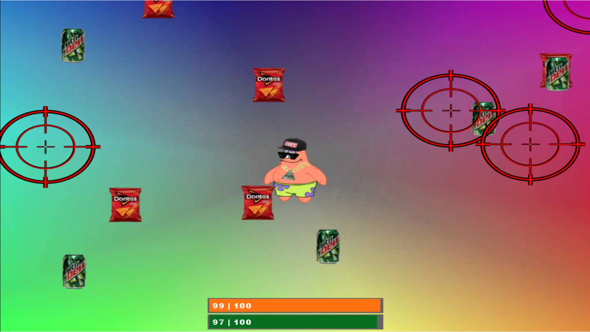

This program is an expansion of my first Java program "Dodgeball". While the overall objective of dodging items on screen remain the same, there is an extra layer of difficulty.
In addition to doding elements on screen, you have two depleting health bars. Certain elements on screen must also be collected in order to stay alive.

Like my previous project "Dodgeball", I really enjoyed creating this program. This project really tested my understanding of conditional statements and loops. I spent a lot of time fixing bugs in this game. Health bars were not updating properly, game ending events were not triggering when they were supposed to, hit boxes were not registering, and game elements were not appearing as intended. 
 
Gameplay: <https://www.youtube.com/watch?v=bkI2nx1bYWE> 
