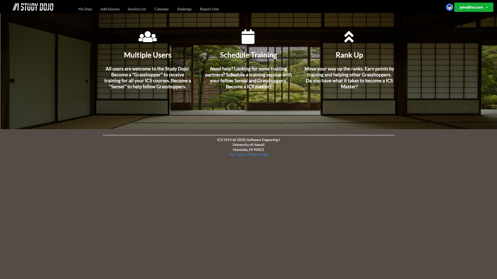

 
[Study Dojo](https://study-dojo.github.io/) is a website that enables students to learn and teach their peers. Students can register as a “Sensei” for classes they are willing to  help and “Grasshopper” for classes they are currently enrolled in. For each course they are registered as a Grasshopper, students can propose study sessions around a topic and a time. This notifies all grasshoppers and sensei for that course, allowing them to respond if they intend to attend the study session.

This project is the result of all the skills and knowledge I acquired in ICS 314 at UH Manoa. Prior to this class, I had no experience creating any sort of web application. Some of the new skills and toolsets I acquired in ICS 314 that I applied to this project are: Javascript, HTML/CSS, Semantic UI, React,js, MongoDB, and Github. Study Dojo is a group project created alongside 3 other ICS 314 students: Darnell Domingo, Justin Mar, and Kevin Quilantang. My contributions to this project include creating the Home/Landing page, Profile Page, Calendar Page, Report/Admin Page, and Rankings page.

Working on this project really helped me understand the topics covered in ICS 314. As a programmer, I learn best by doing. I learn from my failures, troubleshooting lines of code, and researching solutions. The front-end development was fun for me as I was able to delve into my creative side. The challenge for me was working on the back-end. I loved the look and interface of my webpages but I ran into issues with updating and collecting user data. After working on the Profile and Rankings page in particular, I developed a deeper understanding of databases using MongoDB and Simple Schema. In order to create these pages, I had to collect and store user data from all profiles such as name, bio, profile picture, and score. I also had to update and store these values in the database. Working on Study Dojo's scoring and rank system really deepened my understanding of data collection and storage since I had to collect and store all user's scores and sort them to create a leaderboard.

Another important skill I learned from creating Study Dojo was group project development, and project management. This project was created using GitHub and in doing so, I learned all about creating repositories, merging, and branching. GitHub allowed our group to work on different elements of the application with out our code interfering with each other. Also, due to the current COVID-19 situation, this group project was done entirely online, with no in person meetings. I found this to be a very valuable lesson as many companies today have taken this work from home approach. Working from home created a bunch of new challenges to developing Study Dojo. Communication is key to any project and my group accomplished this with virtual meetings and messages throughout the week. 

Click [here](https://study-dojo.me) for a running deployment of Study Dojo!

Click [here](https://github.com/study-dojo) to view our Github organization page and source code!
